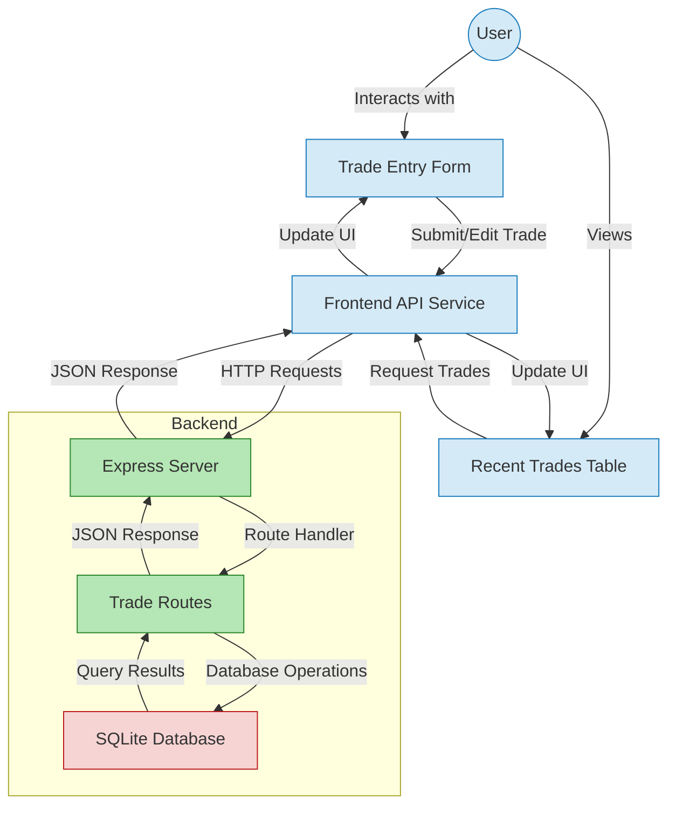

# TradeLab Data Flow Architecture



## Data Flow Description

### 1. Frontend Layer
- **User Interface**
  - Trade Entry Form: Captures trade data
  - Recent Trades Table: Displays trade history
  - Custom Confirmation Dialog: Handles delete confirmations

- **Frontend API Service (`api.js`)**
  - Manages all HTTP requests to backend
  - Handles API responses and errors
  - Formats data for UI components

### 2. API Communication Layer
- **HTTP Methods**
  - GET: Fetch trades
  - POST: Create new trade
  - PUT: Update existing trade
  - DELETE: Remove trade

- **Endpoints**
  - `/api/trades`: Main trade operations
  - `/api/trades/recent`: Recent trades (last 10)
  - `/api/trades/:id`: Single trade operations

### 3. Backend Layer
- **Express Server**
  - Handles incoming HTTP requests
  - Manages CORS and request logging
  - Routes requests to appropriate handlers

- **Route Handlers**
  - Validate incoming requests
  - Process trade operations
  - Format responses

- **Database Operations**
  - Execute SQL queries
  - Manage trade records
  - Handle timestamps

### 4. Database Layer (SQLite)
- **Trade Table Schema**
  ```sql
  trades (
    id INTEGER PRIMARY KEY AUTOINCREMENT,
    date TEXT NOT NULL,
    symbol TEXT NOT NULL,
    direction TEXT NOT NULL,
    market TEXT NOT NULL,
    entryPrice REAL NOT NULL,
    exitPrice REAL,
    quantity INTEGER NOT NULL,
    investment REAL NOT NULL,
    pnl REAL,
    roi REAL,
    notes TEXT,
    created_at DATETIME DEFAULT CURRENT_TIMESTAMP,
    updated_at DATETIME DEFAULT CURRENT_TIMESTAMP
  )
  ```

## Data Flow Examples

### Creating a New Trade
1. User fills trade entry form
2. Frontend validates input
3. `api.js` sends POST request to `/api/trades`
4. Express routes request to trade handler
5. Database creates new trade record
6. Success response flows back to UI
7. Recent trades table updates automatically

### Deleting a Trade
1. User clicks delete button
2. Custom confirmation dialog appears
3. On confirm, `api.js` sends DELETE request
4. Express validates trade exists
5. Database removes trade record
6. Success response flows back to UI
7. Trade removed from recent trades table

### Viewing Recent Trades
1. Page loads or user refreshes
2. `api.js` sends GET request to `/api/trades/recent`
3. Express fetches last 10 trades
4. Database returns trade records
5. Data flows back to frontend
6. Recent trades table updates with new data
